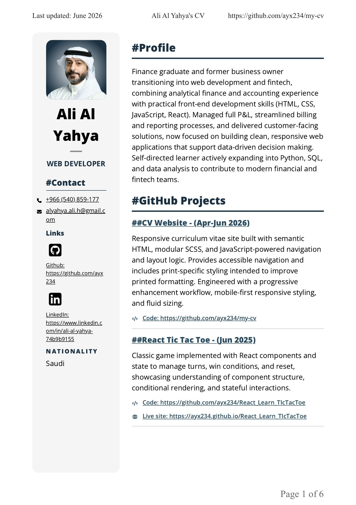

# Ali Al Yahya's CV Webpage

## Table of Contents

- [Overview](#overview)
  - [Project Description](#project-description)
  - [Screeshots](#screenshots)
    - [Mobile - Smaller Screens](#mobile---smaller-screens-width--375px)
    - [Tablets - Medium Screens](#tablets---medium-screens-width--768px)
    - [Desktop - Larger Screens](#desktop---larger-screens-width--1600px)
    - [Print](#print-paper-size--a4)
  - [Links](#links)
- [My Process](#my-process)
  - [Built With](#built-with)
  - [What I Learned](#what-i-learned)
    - [HTML](#what-i-learned---html)
    - [CSS](#what-i-learned---css)
    - [JavaScript](#what-i-learned---javascript)
  - [Notes](#notes)
- [Coming Updates](#coming-updates)
- [Author](#author)

## Overview

### Project Description

Responsive curriculum vitae site built with semantic HTML, modular SCSS, and JavaScript-powered navigation and layout logic. Provides accessible navigation and includes print-specific styling intended to improve printed formatting. Engineered with a progressive enhancement workflow, mobile-first responsive styling, and fluid sizing.

### Screenshots

#### Mobile - Smaller Screens (width = 375px)


#### Tablets - Medium Screens (width = 768px)


#### Desktop - Larger Screens (width = 1600px)


#### Print (Paper size = A4)

Note: This print page respresents that of desktop Chrome or Chromium based browsers. Other browsers might present page breaks and related styles with some differences.



### Links

- [Github Page](https://github.com/ayx234/my-cv)
- [Live Site](https://ayx234.github.io/my-cv)

## My Process

### Built With

- Progressive enhancement approach
  - The page is usable with HTML only, then progressively adds presentation with CSS and interactivity with JavaScript when each capability is available
- Mobile-first workflow
  - The base design (CSS) is for mobile devices. Larger screen styles are applied on top when screens are larger
- Fluid Responsive Design
  - Sizing depends first on fluid values using `clamp()` rather than on screen size breakpoints
  - Includes spacing and typography
- Semantic HTML5 markup
- SASS (CSS Preprocessor)
  - Modular structure
  - CSS variables
  - SASS Mixins
  - Flexbox
  - CSS Grid
- Javascript
  - To optemize presentation of laytout and navigation

### What I Learned

#### What I Learned - HTML

##### Open Graph

Using Open Graph schema to represent the page when the URL is shared on social media.

##### ARIA

For buttons that toggle visible elements, `aria-controls` and `aria-expanded` attributes should be given for proper accessibility support.

```HTML
<button
 class="nav-button"
 ...
 aria-controls="nav-ul"
 aria-expanded="false"
>
```

##### Media Elements

###### Media Attributes

`loading="lazy"` defers loading media until it's near the viewport. This mproves initial page load time and reduces bandwidth use.

`decoding="async"` lets the browser to decode the media in the background without blocking page rendering as much. This helps improving performance and responsiveness.

Example:

```HTML

```

###### Graphic Elements

Graphic elements such as ``, `<svg>`, and `<video>` should be given a `width` attribute, and `height` when needed, to insure proper proportions when CSS is not available.

```HTML
"
/>
```

##### Download links

Use `<a>` with the `download` attribute and `href` for the relative path to the downloadable file. `<button>` elements don't have this capability.

```html
<a
  href="file-name.extension"
  download
>Download file-name</a>
```

#### What I Learned - CSS

##### Print Styles

page breaks help keeing related content on the same page with the following rules:

```CSS
.avoid-breaks-between-pages {
  break-inside: avoid;
  break-after: avoid; /* useful for headings */
  break-before: avoid;
}
```

IMPORTANT: browsers differ in the implementation of rules above even though the rules are supported supported in all major browsers For this website desktop Chrome and Chromium based browsers implemented these rules as intended, while others did not.

The following rules are also recommended as fallback for older browsers and because implementation is not uniform yet for the above rules

```CSS
.avoid-breaks-between-pages {
  page-break-inside: avoid;
  page-break-after: avoid; /* useful for headings */
  page-break-before: avoid;
}
```

The following properties are only supported on Chrome and Chromium - Jun 2026

```CSS
.avoid-breaks-between-pages {
  widows: <number>; /* lines of text that appear top of the next page */
  orphans: <number>; /* lines of text that appear alone on the previous page */
}
```

##### Avoiding Overlap of Sticky Elements when Navigating

```CSS
.nav {
  position: sticky;
  top: 0;
  z-index: 999;
}
```

When sticky elements cover sections navigated to through `<a href="#internal-link">` a `scroll-margin-top` needs to be given to the elements navigated to so this issue is corrected.

###### Height is Fixed for Sticky Element

If `height` of the sticky elements is fixed,`scroll-margin-top` can be given with fixed values to the elements navigated to.

```CSS
.nav {
  height: 200px;
}

.section {
  scroll-margin-top: 200px;
}
```

###### Sticky Element Only has SVG, Padding and Margin

If `height` of the sticky elements only depends on `margin`, `padding` and height of `<svg>` elements, the `scroll-margin-top` of the elements navigated to can be calculated based on these values. (if these values use `clamp()`, the same values can be added here to calculate `scroll-margin-top`)

```HTML
<nav>
  <button>
    <svg ...>
  </button>
</nav>
...
<a href="#my-section">...</a>
<section id"my-section"=>...</section>
```

```CSS
nav {
  padding-block: var(--variable-padding-value);
  margin-block: var(--variable-margin-value);
}

svg {
  height: var(--variable-svg-height);
}

section {
  scroll-margin-top: calc(2 * var(--variable-padding-value) + 2 * var(--variable-margin-value) + var(--variable-svg-height))
}
```

###### Sticky Element Has Text with Variable Font Size

If `height` of the sticky elements contains text, the size would not be predictable and JavaScript needs to be used to calculate the size of the elements covering the destination and the `scroll-margin-top` will also have to be set using JavaScript.

##### Horizontally Center an Element That Has a Sibling

If you have two siblings, one of which you want to center horizontally while pushing the other sibling to the side, use this for the parent:

```CSS
.parent {
  display: grid;
  grid-template-columns: 1fr auto 1fr;
}
```

##### Sizing of SVG Elements
  
Sizing on browsers is quirky (April 2026).
For correct representation, use the following rules:

- Use only one css class for each `<svg>`
- `font-size` must be set
- `width` must be set for the element to appear
- `height` is also recommended to be used.
- use `1em` so `height` and `width` reflect `font-size`

##### Minimum Sizing of Interactable Elements and Text Boxes

Interactable elements such as `<button>`, `input[type="text"]`, and `input[type="email"]` need enough space for touch interaction (fingers) especially on small devices.

This also applies to text boxes (text with buttons like appearance).

The following CSS is recommended for accessibility:

```CSS
.text-box {
 padding: 0.5em 1em; /* approximate values */
 border: .125em solid currentcolor; /* approximate values */
 min-height: 44px;
}
```

#### What I Learned - JavaScript

##### Guared Clauses

An approach of Defensive Programming that makes a function return early if the required DOM elements or data don't exist.

This is an example of guard clauses in this project:

```JS
function initNav() {
 if (
  !MAIN_NAV ||
  !MAIN_NAV_BUTTON_CONTAINER ||
  !MAIN_NAV_BUTTON ||
  !MAIN_NAV_LINKS_UL ||
  MAIN_NAV_LINKS.length === 0 ||
  !MAIN_NAV_LI_HOME ||
  NAV_LINKS.length === 0
 ) {
  /*  Defensive check in case class names changed later 
  or for network issues etc */
  console.warn("Navigation elements not found");
  return;
 }
 ...
}
```

Guard clauses serve the following purposes:

- **Preconditions up front**: Checks that the reauired DOM elements, or data, are available before running the rest of the function.
- **Prevents runtime errors**: Avoids things like `"Cannot read properties of null/undefined"` or iterating over empty/undefined collections.
- **Reduces nesting**: If conditions are all in one block instead of being nested.
- **Makes failures explicit**: `console.warn(...)` gives you a clear signal where the function failed.

##### Event Listener for Back/Forward Navigation

```JS
// Handle browser back/forward navigation
 window.addEventListener("hashchange", () => {
  scrollToAnchor(window.location.hash);
 });
```

##### Event Listener for When Windows Resizes

```JS
window.addEventListener("resize", <function>);
```

##### Checking a Specific Window Width Breakpoint

```JS
window.matchMedia("(min-width: 1500px)");
```

##### Checking if the Document is Loading

Checking if the document's loading has start but not yet completed:

```JS
if (document.readyState === "loading") {...}
```

## Notes

### Notes - Git

- Earlier commits have many changes between commits. Breaking up changes into smaller commits would have been better.

### Notes - HTML

- "#" hashtags for `<h2>` and `<h3>` inside `<a>`
are inserted manually in html instead of through
using `::before` because vscodes' formatter inserts white spaces when not needed.
  - Solutions such as giving `{display: flex}` to `.h3` mess up the layout at some situations.
- `#nav-button-container` has an inline `display:none;`. This is for progressive enhancement. The element shouldn't appear when only HTML work (no CSS or JS). Adding this element, including
an `<svg>` child, is complicated and prone to errors using plain JS. JS modifies this inline style value when it's available.

### Notes - CSS

#### Notes - CSS - Print Styles

`_print.scss`

- Page breaks using `page-break-inside` `break-inside` `break-after` etc...
  - These styles are applyt as intended on Chrome and Edge
  - They are not applying as intended on Firefox
     or browsers on iOS (June 2026).

#### Font Importing

In `_settings.scss`:

- `@import` is used for faster loading when users have the font
loaded on their machines.
- `@font-face` is a fallback

#### min-height for Interactable Elements

`@mixin text-box` has hardcoded `min-height: 44px`.
This `px` value is the minimum absolute value recommended for accessibility.

### Notes - Project Shortcomings

- Usage of magic numbers for breakpoints
  - Note that layout breakpoints are recommended to be used this way, based on when approapriate, rather than based device breakpoints such as 375px, 768px etc...
- Large-screen-layout and print layout go through "DOM surgery" when JS is available. This complicates the maintainability and readability of code.

## Coming Updates

- update page pdf for download
- have AI make this readme into a proper docs
- add dark mode support
- turn JS into modules.
- _print.scss
  - re-organize file
  - fine-tune print layout when no js
  - remove non-used styles
  - make all color values variables

## Author

Github - [Ali Al Yahya](https://github.com/ayx234/)
